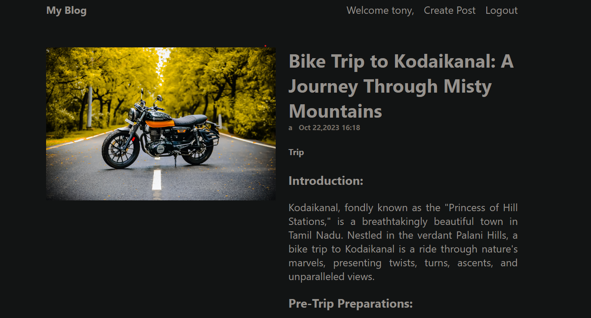

# MERN Blog Website

Welcome to our MERN (MongoDB, Express.js, React, Node.js) stack blog website!

This website allows users to read and write blog posts, powered by the MERN stack.



## Live Demo

Check out the live demo of the website [here](https://blog-guxz.vercel.app/).

## Features

- **User Authentication**: Users can sign up, log in, and log out securely.
- **Create Posts**: Authenticated users can create new blog posts.
- **Read Posts**: Users can browse and read existing blog posts.
- **Responsive Design**: The website is optimized for various devices, including desktops, tablets, and mobile phones.

## Technologies Used

- **MongoDB**: NoSQL database for storing blog post data.
- **Express.js**: Backend framework for handling HTTP requests and routing.
- **React**: Frontend library for building the user interface.
- **Node.js**: JavaScript runtime environment for running server-side code.
- **Vercel**: Platform for hosting the website and deploying frontend applications.
- **Render**: Platform for hosting the website and deploying Backend services.

## Usage

To run this project locally, follow these steps:

1. Clone the repository:

   ```bash
  [ git clone https://github.com/your-username/mern-blog.git](https://github.com/dhanarajappu456/Blog.git)https://github.com/dhanarajappu456/Blog.git
